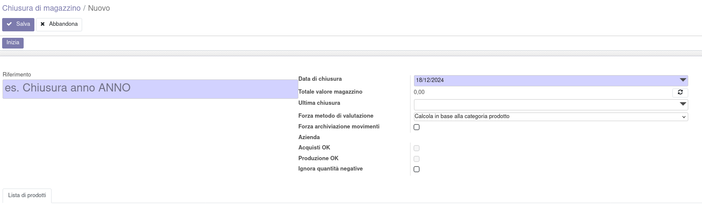
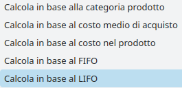
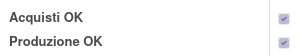
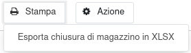

La chiusura di magazzino è accessibile dal menu:

Qui è possibile creare la chiusura dalla prima voce:

In questa maschera è necessario inserire il nome, la data in cui verrà calcolata la giacenza dei prodotti e il metodo di valuzione a scelta tra i seguenti:

È possibile impostare di ignorare le quantità negative a magazzino, nel caso sia necessario (tenendo conto che vanno comunque sistemate):

Si può quindi avviare la procedura con il seguente bottone, che calcola le giacenze dei prodotti alla data indicata:

Il passaggio successivo è avviare il calcolo dei prodotti acquistati (ci metterà un po' di tempo, quindi lasciarlo lavorare). Il calcolo del costo prende il prezzo dalla fattura collegata all'ordine, se esiste ed è validata, altrimenti dall'ordine, infine dal prodotto.

Nel caso sia installata l'app produzione, avviare il calcolo dei manufatti con questo bottone (anche questo impiegherà del tempo):

Alla fine dei calcoli saranno marcati i flag seguenti, per indicare che sono stati eseguiti correttamente:

Si può quindi validare la chiusura (che si può sempre riportare a bozza e rifare) con questo bottone, che provvede anche ad eliminare le righe con quantità negativa o pari a zero:

È infine possibile esportare un report in xlsx:

