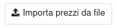

Nella chiusura di magazzino è disponibile un bottone per caricare un file, precedentemente esportata dalla stessa, o un'altra chiusura, o creato manualmente, che abbia almeno una colonna il cui nome contenga `costo`, `prezzo` o `unit` e una `prodotto`, senza riguardo delle maiuscole/minuscole:

Quindi è possibile eseguire la sovrascrittura dei prezzi a video con quelli presenti nel file appena caricato, cliccando su questo bottone:

Non è necessario fare i calcoli dei costi dagli acquisti e dalla produzione quando si caricano i prezzi con questa funzionalità. È sufficiente quindi avviare la chiusura, importare i prezzi e poi validarla.
