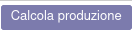

Close period production recompute
=================================

In the close period record there is a new button to recompute product prices on BOM values and time spent:

This value is computed with this formula:

- duration expected = time start + time stop + (sum of time cycle * time efficiency / 100)
- price of operations = duration expected / 60 * hour cost of workcenter
- price of components = sum of components * quantity * price (recursive)
- total price = price of operations + price of components

It is possible to get product prices from standard price, without computation, by flagging the option "Force Standard Price":

The components prices are computed from the same closing period, if presents in rows, otherwise they are computed as described above.

Ricalcolo della produzione nel periodo di chiusura
==================================================

Nel record del periodo di chiusura è presente un nuovo pulsante per ricalcolare i prezzi dei prodotti in base ai valori della distinta base e al tempo impiegato:

Questo valore viene calcolato con questa formula:

- durata prevista = tempo di inizio + tempo di fine + (somma del ciclo di tempo * efficienza temporale / 100)
- prezzo delle operazioni = durata prevista / 60 * costo orario del centro di lavoro
- prezzo dei componenti = somma dei componenti * quantità * prezzo (ricorsivo)
- prezzo totale = prezzo delle operazioni + prezzo dei componenti

I prezzi dei componenti sono calcolati dalla stessa chiusura di magazzino, se presenti nelle righe, altrimenti sono calcolati come descritto sopra.

È possibile ottenere i prezzi dei prodotti dal prezzo standard, senza calcolo, selezionando l'opzione "Forza prezzo standard":

